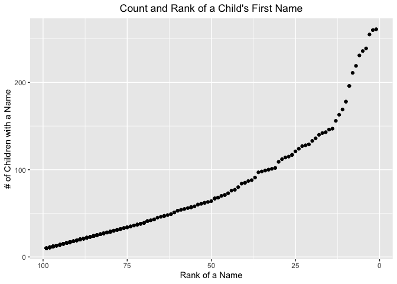

p8105_hw2_pw2551
================
Paula Wu
10/1/2021

Import the libraries:

``` r
library(tidyverse)
library(readxl)
library(lubridate)
```

## Problem 1

Since I’m going to use the file path fairly frequently later, I’d like
to define it beforehand.

``` r
file_path = "./Trash-Wheel-Collection-Totals-8-6-19.xlsx"
```

Read and clean the Mr.Trash Wheel dataset:

``` r
wheels_df = 
  read_excel(file_path, range = "Mr. Trash Wheel!A2:N408") %>% 
  janitor::clean_names() %>%
  filter(!(is.na(dumpster))) %>% # filter out rows that don't have dumpster-specific data
  mutate(sports_balls = round(sports_balls, 0)) # round sports_balls to nearest integer
knitr::kable(wheels_df[0:5,])
```

| dumpster | month | year | date       | weight_tons | volume_cubic_yards | plastic_bottles | polystyrene | cigarette_butts | glass_bottles | grocery_bags | chip_bags | sports_balls | homes_powered |
|---------:|:------|-----:|:-----------|------------:|-------------------:|----------------:|------------:|----------------:|--------------:|-------------:|----------:|-------------:|--------------:|
|        1 | May   | 2014 | 2014-05-16 |        4.31 |                 18 |            1450 |        1820 |          126000 |            72 |          584 |      1162 |            7 |             0 |
|        2 | May   | 2014 | 2014-05-16 |        2.74 |                 13 |            1120 |        1030 |           91000 |            42 |          496 |       874 |            5 |             0 |
|        3 | May   | 2014 | 2014-05-16 |        3.45 |                 15 |            2450 |        3100 |          105000 |            50 |         1080 |      2032 |            6 |             0 |
|        4 | May   | 2014 | 2014-05-17 |        3.10 |                 15 |            2380 |        2730 |          100000 |            52 |          896 |      1971 |            6 |             0 |
|        5 | May   | 2014 | 2014-05-17 |        4.06 |                 18 |             980 |         870 |          120000 |            72 |          368 |       753 |            7 |             0 |

<br> Read and clean precipitation data for 2018:

``` r
year_2018 = 
  read_excel(file_path, range = "2018 Precipitation!A2:B14") %>%  # only cells between A2:B14 are relevant
  janitor::clean_names() %>% 
  mutate(year = 2018)
knitr::kable(year_2018[0:10,])
```

| month | total | year |
|------:|------:|-----:|
|     1 |  0.94 | 2018 |
|     2 |  4.80 | 2018 |
|     3 |  2.69 | 2018 |
|     4 |  4.69 | 2018 |
|     5 |  9.27 | 2018 |
|     6 |  4.77 | 2018 |
|     7 | 10.20 | 2018 |
|     8 |  6.45 | 2018 |
|     9 | 10.47 | 2018 |
|    10 |  2.12 | 2018 |

Read and clean precipitation data for 2019: we only got precipitation
data from Jan to Jun during 2019

``` r
year_2019 = 
  read_excel(file_path, range = "2019 Precipitation!A2:B8") %>%
  janitor::clean_names() %>% 
  mutate(year = 2019)
knitr::kable(year_2019[0:6,])
```

| month | total | year |
|------:|------:|-----:|
|     1 |  3.10 | 2019 |
|     2 |  3.64 | 2019 |
|     3 |  4.47 | 2019 |
|     4 |  1.46 | 2019 |
|     5 |  3.58 | 2019 |
|     6 |  0.42 | 2019 |

Combine previous two data sets:

``` r
# stack these two data sets together
two_years = 
  bind_rows(year_2018, year_2019) %>% 
  mutate(month = month.name[month])  # convert month to character variable
knitr::kable(list(two_years[0:9,], two_years[10:18,]), format = 'html', booktabs = TRUE)
```

<table class="kable_wrapper">
<tbody>
<tr>
<td>
<table>
<thead>
<tr>
<th style="text-align:left;">
month
</th>
<th style="text-align:right;">
total
</th>
<th style="text-align:right;">
year
</th>
</tr>
</thead>
<tbody>
<tr>
<td style="text-align:left;">
January
</td>
<td style="text-align:right;">
0.94
</td>
<td style="text-align:right;">
2018
</td>
</tr>
<tr>
<td style="text-align:left;">
February
</td>
<td style="text-align:right;">
4.80
</td>
<td style="text-align:right;">
2018
</td>
</tr>
<tr>
<td style="text-align:left;">
March
</td>
<td style="text-align:right;">
2.69
</td>
<td style="text-align:right;">
2018
</td>
</tr>
<tr>
<td style="text-align:left;">
April
</td>
<td style="text-align:right;">
4.69
</td>
<td style="text-align:right;">
2018
</td>
</tr>
<tr>
<td style="text-align:left;">
May
</td>
<td style="text-align:right;">
9.27
</td>
<td style="text-align:right;">
2018
</td>
</tr>
<tr>
<td style="text-align:left;">
June
</td>
<td style="text-align:right;">
4.77
</td>
<td style="text-align:right;">
2018
</td>
</tr>
<tr>
<td style="text-align:left;">
July
</td>
<td style="text-align:right;">
10.20
</td>
<td style="text-align:right;">
2018
</td>
</tr>
<tr>
<td style="text-align:left;">
August
</td>
<td style="text-align:right;">
6.45
</td>
<td style="text-align:right;">
2018
</td>
</tr>
<tr>
<td style="text-align:left;">
September
</td>
<td style="text-align:right;">
10.47
</td>
<td style="text-align:right;">
2018
</td>
</tr>
</tbody>
</table>
</td>
<td>
<table>
<thead>
<tr>
<th style="text-align:left;">
month
</th>
<th style="text-align:right;">
total
</th>
<th style="text-align:right;">
year
</th>
</tr>
</thead>
<tbody>
<tr>
<td style="text-align:left;">
October
</td>
<td style="text-align:right;">
2.12
</td>
<td style="text-align:right;">
2018
</td>
</tr>
<tr>
<td style="text-align:left;">
November
</td>
<td style="text-align:right;">
7.82
</td>
<td style="text-align:right;">
2018
</td>
</tr>
<tr>
<td style="text-align:left;">
December
</td>
<td style="text-align:right;">
6.11
</td>
<td style="text-align:right;">
2018
</td>
</tr>
<tr>
<td style="text-align:left;">
January
</td>
<td style="text-align:right;">
3.10
</td>
<td style="text-align:right;">
2019
</td>
</tr>
<tr>
<td style="text-align:left;">
February
</td>
<td style="text-align:right;">
3.64
</td>
<td style="text-align:right;">
2019
</td>
</tr>
<tr>
<td style="text-align:left;">
March
</td>
<td style="text-align:right;">
4.47
</td>
<td style="text-align:right;">
2019
</td>
</tr>
<tr>
<td style="text-align:left;">
April
</td>
<td style="text-align:right;">
1.46
</td>
<td style="text-align:right;">
2019
</td>
</tr>
<tr>
<td style="text-align:left;">
May
</td>
<td style="text-align:right;">
3.58
</td>
<td style="text-align:right;">
2019
</td>
</tr>
<tr>
<td style="text-align:left;">
June
</td>
<td style="text-align:right;">
0.42
</td>
<td style="text-align:right;">
2019
</td>
</tr>
</tbody>
</table>
</td>
</tr>
</tbody>
</table>

## Problem 2

Read and manipulate data from “pols-month.csv”

``` r
pols = 
  read_csv("./fivethirtyeight_datasets/pols-month.csv", show_col_types = FALSE) %>% 
  separate(mon, into = c('year', 'month', 'day'), sep = "-", convert = TRUE) %>% 
  mutate(month = month.name[month]) %>% 
  mutate(president = recode(prez_dem, `1` = "dem", `0` = "gop")) %>% 
  #filter(prez_gop == 2)
  select(-c(prez_dem, prez_gop, day))
pols
```

    ## # A tibble: 822 × 9
    ##     year month     gov_gop sen_gop rep_gop gov_dem sen_dem rep_dem president
    ##    <int> <chr>       <dbl>   <dbl>   <dbl>   <dbl>   <dbl>   <dbl> <chr>    
    ##  1  1947 January        23      51     253      23      45     198 dem      
    ##  2  1947 February       23      51     253      23      45     198 dem      
    ##  3  1947 March          23      51     253      23      45     198 dem      
    ##  4  1947 April          23      51     253      23      45     198 dem      
    ##  5  1947 May            23      51     253      23      45     198 dem      
    ##  6  1947 June           23      51     253      23      45     198 dem      
    ##  7  1947 July           23      51     253      23      45     198 dem      
    ##  8  1947 August         23      51     253      23      45     198 dem      
    ##  9  1947 September      23      51     253      23      45     198 dem      
    ## 10  1947 October        23      51     253      23      45     198 dem      
    ## # … with 812 more rows

``` r
#unique(pull(pols, prez_gop))
```

<br> Read and manipulate data from “snp.csv”

``` r
snp = 
  read_csv("./fivethirtyeight_datasets/snp.csv", show_col_types = FALSE) %>% 
  mutate(date = parse_date_time2(date, 'mdy', cutoff_2000 = 49)) %>% 
  separate(date, into = c('year', 'month', 'day'), sep = "-", convert = TRUE) %>% 
  mutate(month = month.name[month]) %>% 
  arrange(year, month) %>%
  select(-day) %>% 
  select(year, month, everything())
view(snp)
```

<br> Read and manipulate data from “unemployment.csv”

``` r
unemploy =
  read_csv("./fivethirtyeight_datasets/unemployment.csv", show_col_types = FALSE) %>% 
  janitor::clean_names() %>% 
  pivot_longer(jan:dec, names_to = "month", values_to = "unemploy_rate") %>% 
  mutate(year = as.integer(year)) %>% # change type to integer for `year`
  mutate(month = month.name[match(str_to_title(month), month.abb)])  #acceptable?
unemploy
```

    ## # A tibble: 816 × 3
    ##     year month     unemploy_rate
    ##    <int> <chr>             <dbl>
    ##  1  1948 January             3.4
    ##  2  1948 February            3.8
    ##  3  1948 March               4  
    ##  4  1948 April               3.9
    ##  5  1948 May                 3.5
    ##  6  1948 June                3.6
    ##  7  1948 July                3.6
    ##  8  1948 August              3.9
    ##  9  1948 September           3.8
    ## 10  1948 October             3.7
    ## # … with 806 more rows

Merge `snp` into `pols`:

``` r
merge_1 = left_join(pols, snp, by = c('year', 'month'))
merge_1
```

    ## # A tibble: 822 × 10
    ##     year month   gov_gop sen_gop rep_gop gov_dem sen_dem rep_dem president close
    ##    <int> <chr>     <dbl>   <dbl>   <dbl>   <dbl>   <dbl>   <dbl> <chr>     <dbl>
    ##  1  1947 January      23      51     253      23      45     198 dem          NA
    ##  2  1947 Februa…      23      51     253      23      45     198 dem          NA
    ##  3  1947 March        23      51     253      23      45     198 dem          NA
    ##  4  1947 April        23      51     253      23      45     198 dem          NA
    ##  5  1947 May          23      51     253      23      45     198 dem          NA
    ##  6  1947 June         23      51     253      23      45     198 dem          NA
    ##  7  1947 July         23      51     253      23      45     198 dem          NA
    ##  8  1947 August       23      51     253      23      45     198 dem          NA
    ##  9  1947 Septem…      23      51     253      23      45     198 dem          NA
    ## 10  1947 October      23      51     253      23      45     198 dem          NA
    ## # … with 812 more rows

## Problem 3

Read data, clean variable names and childs’ first names

``` r
baby_names = 
  read_csv("./Popular_Baby_Names.csv",show_col_types = FALSE) %>% 
  janitor::clean_names() %>% 
  mutate(childs_first_name = str_to_title(childs_first_name))
```

Check for ethnicity names

``` r
# check different names of variable `ethnicity`
unique(pull(baby_names, ethnicity))
```

    ## [1] "ASIAN AND PACIFIC ISLANDER" "BLACK NON HISPANIC"        
    ## [3] "HISPANIC"                   "WHITE NON HISPANIC"        
    ## [5] "ASIAN AND PACI"             "BLACK NON HISP"            
    ## [7] "WHITE NON HISP"

It’s clear that people change the ethnicity encoding overtime: “BLACK
NON HISPANIC” used to be coded as “BLACK NON HISP”, “WHITE NON HISPANIC”
used to be coded as “WHITE NON HISP”, and etc. <br> I will rename the
variable `ethnicity`, and make sure it is consistent across the data
frame.

``` r
baby_names = 
  baby_names %>% 
  mutate(ethnicity = replace(ethnicity, grepl('BLACK', ethnicity), 'BLACK NON HISPANIC')) %>% 
  mutate(ethnicity = replace(ethnicity, grepl('WHITE', ethnicity), 'WHITE NON HISPANIC')) %>%
  mutate(ethnicity = replace(ethnicity, grepl('ASIAN', ethnicity), 'ASIAN AND PACIFIC ISLANDER'))

# check consistency
unique(pull(baby_names, ethnicity))
```

    ## [1] "ASIAN AND PACIFIC ISLANDER" "BLACK NON HISPANIC"        
    ## [3] "HISPANIC"                   "WHITE NON HISPANIC"

There are only four groups, which means I successfully tidy values in
`ethnicity` variable. <br> And then remove duplicate rows:

``` r
baby_names = 
  baby_names %>% 
  distinct(year_of_birth, gender, ethnicity, childs_first_name, count, rank, .keep_all = TRUE)
baby_names
```

    ## # A tibble: 12,181 × 6
    ##    year_of_birth gender ethnicity                  childs_first_name count  rank
    ##            <dbl> <chr>  <chr>                      <chr>             <dbl> <dbl>
    ##  1          2016 FEMALE ASIAN AND PACIFIC ISLANDER Olivia              172     1
    ##  2          2016 FEMALE ASIAN AND PACIFIC ISLANDER Chloe               112     2
    ##  3          2016 FEMALE ASIAN AND PACIFIC ISLANDER Sophia              104     3
    ##  4          2016 FEMALE ASIAN AND PACIFIC ISLANDER Emily                99     4
    ##  5          2016 FEMALE ASIAN AND PACIFIC ISLANDER Emma                 99     4
    ##  6          2016 FEMALE ASIAN AND PACIFIC ISLANDER Mia                  79     5
    ##  7          2016 FEMALE ASIAN AND PACIFIC ISLANDER Charlotte            59     6
    ##  8          2016 FEMALE ASIAN AND PACIFIC ISLANDER Sarah                57     7
    ##  9          2016 FEMALE ASIAN AND PACIFIC ISLANDER Isabella             56     8
    ## 10          2016 FEMALE ASIAN AND PACIFIC ISLANDER Hannah               56     8
    ## # … with 12,171 more rows

<br> How the name **Olivia** change overtime

``` r
olivias = 
  baby_names %>% 
  filter(childs_first_name == "Olivia") %>% 
  select(-c(childs_first_name, gender, count)) %>% 
  pivot_wider(names_from = "year_of_birth", values_from = "rank")
olivias
```

    ## # A tibble: 4 × 7
    ##   ethnicity                  `2016` `2015` `2014` `2013` `2012` `2011`
    ##   <chr>                       <dbl>  <dbl>  <dbl>  <dbl>  <dbl>  <dbl>
    ## 1 ASIAN AND PACIFIC ISLANDER      1      1      1      3      3      4
    ## 2 BLACK NON HISPANIC              8      4      8      6      8     10
    ## 3 HISPANIC                       13     16     16     22     22     18
    ## 4 WHITE NON HISPANIC              1      1      1      1      4      2

Popular boys names

``` r
# search for the most popular names for boys
boys = 
  baby_names %>% 
  filter(rank == 1 & gender == "MALE") %>% 
  select(-c(gender, rank, count)) %>% 
  pivot_wider(names_from = "year_of_birth", values_from = "childs_first_name")
boys
```

    ## # A tibble: 4 × 7
    ##   ethnicity                  `2016` `2015` `2014` `2013` `2012` `2011` 
    ##   <chr>                      <chr>  <chr>  <chr>  <chr>  <chr>  <chr>  
    ## 1 ASIAN AND PACIFIC ISLANDER Ethan  Jayden Jayden Jayden Ryan   Ethan  
    ## 2 BLACK NON HISPANIC         Noah   Noah   Ethan  Ethan  Jayden Jayden 
    ## 3 HISPANIC                   Liam   Liam   Liam   Jayden Jayden Jayden 
    ## 4 WHITE NON HISPANIC         Joseph David  Joseph David  Joseph Michael

<br> Plotting

``` r
male_white_16 = 
  baby_names %>% 
  filter(year_of_birth == 2016 & ethnicity == "WHITE NON HISPANIC" & gender == "MALE")
ggplot(male_white_16, aes(x = rank, y = count)) + 
  geom_point() + 
  scale_x_reverse() +
  ggtitle("Count and Rank of a Child's First Name") +
  theme(plot.title = element_text(hjust = 0.5)) +
  labs(y = "# of Children with a Name", x = "Rank of a Name")
```

<!-- -->
