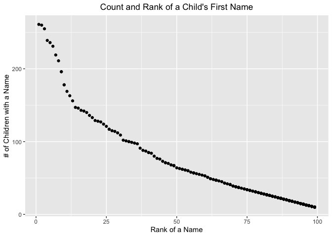

p8105_hw2_pw2551
================
Paula Wu
10/1/2021

Import the libraries:

``` r
library(tidyverse)
library(readxl)
library(lubridate)
```

## Problem 1

Since I’m going to use the file path fairly frequently later, I’d like
to define it beforehand.

``` r
file_path = "./Trash-Wheel-Collection-Totals-8-6-19.xlsx"
```

Read and clean the Mr.Trash Wheel dataset:

``` r
wheels_df = 
  read_excel(file_path, range = "Mr. Trash Wheel!A2:N408") %>% 
  janitor::clean_names() %>%
  filter(!(is.na(dumpster))) %>% # filter out rows that don't have dumpster-specific data
  mutate(sports_balls = round(sports_balls, 0)) # round sports_balls to nearest integer
knitr::kable(wheels_df[0:5,])
```

| dumpster | month | year | date       | weight_tons | volume_cubic_yards | plastic_bottles | polystyrene | cigarette_butts | glass_bottles | grocery_bags | chip_bags | sports_balls | homes_powered |
|---------:|:------|-----:|:-----------|------------:|-------------------:|----------------:|------------:|----------------:|--------------:|-------------:|----------:|-------------:|--------------:|
|        1 | May   | 2014 | 2014-05-16 |        4.31 |                 18 |            1450 |        1820 |          126000 |            72 |          584 |      1162 |            7 |             0 |
|        2 | May   | 2014 | 2014-05-16 |        2.74 |                 13 |            1120 |        1030 |           91000 |            42 |          496 |       874 |            5 |             0 |
|        3 | May   | 2014 | 2014-05-16 |        3.45 |                 15 |            2450 |        3100 |          105000 |            50 |         1080 |      2032 |            6 |             0 |
|        4 | May   | 2014 | 2014-05-17 |        3.10 |                 15 |            2380 |        2730 |          100000 |            52 |          896 |      1971 |            6 |             0 |
|        5 | May   | 2014 | 2014-05-17 |        4.06 |                 18 |             980 |         870 |          120000 |            72 |          368 |       753 |            7 |             0 |

Read and clean precipitation data for 2018:

``` r
year_2018 = 
  read_excel(file_path, range = "2018 Precipitation!A2:B14") %>%  # only cells between A2:B14 are relevant
  janitor::clean_names() %>% 
  mutate(year = 2018)
knitr::kable(year_2018[0:10,])
```

| month | total | year |
|------:|------:|-----:|
|     1 |  0.94 | 2018 |
|     2 |  4.80 | 2018 |
|     3 |  2.69 | 2018 |
|     4 |  4.69 | 2018 |
|     5 |  9.27 | 2018 |
|     6 |  4.77 | 2018 |
|     7 | 10.20 | 2018 |
|     8 |  6.45 | 2018 |
|     9 | 10.47 | 2018 |
|    10 |  2.12 | 2018 |

Read and clean precipitation data for 2019: we only got precipitation
data from Jan to Jun during 2019

``` r
year_2019 = 
  read_excel(file_path, range = "2019 Precipitation!A2:B8") %>%
  janitor::clean_names() %>% 
  mutate(year = 2019)
knitr::kable(year_2019[0:6,])
```

| month | total | year |
|------:|------:|-----:|
|     1 |  3.10 | 2019 |
|     2 |  3.64 | 2019 |
|     3 |  4.47 | 2019 |
|     4 |  1.46 | 2019 |
|     5 |  3.58 | 2019 |
|     6 |  0.42 | 2019 |

Combine previous two data sets:

``` r
# stack these two data sets together
two_years = 
  bind_rows(year_2018, year_2019) %>% 
  mutate(month = month.name[month])  # convert month to character variable
knitr::kable(list(two_years[0:9,], two_years[10:18,]), format = 'html', booktabs = TRUE)
```

<table class="kable_wrapper">
<tbody>
<tr>
<td>
<table>
<thead>
<tr>
<th style="text-align:left;">
month
</th>
<th style="text-align:right;">
total
</th>
<th style="text-align:right;">
year
</th>
</tr>
</thead>
<tbody>
<tr>
<td style="text-align:left;">
January
</td>
<td style="text-align:right;">
0.94
</td>
<td style="text-align:right;">
2018
</td>
</tr>
<tr>
<td style="text-align:left;">
February
</td>
<td style="text-align:right;">
4.80
</td>
<td style="text-align:right;">
2018
</td>
</tr>
<tr>
<td style="text-align:left;">
March
</td>
<td style="text-align:right;">
2.69
</td>
<td style="text-align:right;">
2018
</td>
</tr>
<tr>
<td style="text-align:left;">
April
</td>
<td style="text-align:right;">
4.69
</td>
<td style="text-align:right;">
2018
</td>
</tr>
<tr>
<td style="text-align:left;">
May
</td>
<td style="text-align:right;">
9.27
</td>
<td style="text-align:right;">
2018
</td>
</tr>
<tr>
<td style="text-align:left;">
June
</td>
<td style="text-align:right;">
4.77
</td>
<td style="text-align:right;">
2018
</td>
</tr>
<tr>
<td style="text-align:left;">
July
</td>
<td style="text-align:right;">
10.20
</td>
<td style="text-align:right;">
2018
</td>
</tr>
<tr>
<td style="text-align:left;">
August
</td>
<td style="text-align:right;">
6.45
</td>
<td style="text-align:right;">
2018
</td>
</tr>
<tr>
<td style="text-align:left;">
September
</td>
<td style="text-align:right;">
10.47
</td>
<td style="text-align:right;">
2018
</td>
</tr>
</tbody>
</table>
</td>
<td>
<table>
<thead>
<tr>
<th style="text-align:left;">
month
</th>
<th style="text-align:right;">
total
</th>
<th style="text-align:right;">
year
</th>
</tr>
</thead>
<tbody>
<tr>
<td style="text-align:left;">
October
</td>
<td style="text-align:right;">
2.12
</td>
<td style="text-align:right;">
2018
</td>
</tr>
<tr>
<td style="text-align:left;">
November
</td>
<td style="text-align:right;">
7.82
</td>
<td style="text-align:right;">
2018
</td>
</tr>
<tr>
<td style="text-align:left;">
December
</td>
<td style="text-align:right;">
6.11
</td>
<td style="text-align:right;">
2018
</td>
</tr>
<tr>
<td style="text-align:left;">
January
</td>
<td style="text-align:right;">
3.10
</td>
<td style="text-align:right;">
2019
</td>
</tr>
<tr>
<td style="text-align:left;">
February
</td>
<td style="text-align:right;">
3.64
</td>
<td style="text-align:right;">
2019
</td>
</tr>
<tr>
<td style="text-align:left;">
March
</td>
<td style="text-align:right;">
4.47
</td>
<td style="text-align:right;">
2019
</td>
</tr>
<tr>
<td style="text-align:left;">
April
</td>
<td style="text-align:right;">
1.46
</td>
<td style="text-align:right;">
2019
</td>
</tr>
<tr>
<td style="text-align:left;">
May
</td>
<td style="text-align:right;">
3.58
</td>
<td style="text-align:right;">
2019
</td>
</tr>
<tr>
<td style="text-align:left;">
June
</td>
<td style="text-align:right;">
0.42
</td>
<td style="text-align:right;">
2019
</td>
</tr>
</tbody>
</table>
</td>
</tr>
</tbody>
</table>

## Problem 2

*Note: for concision purpose, I set `show_col_types` equals to FALSE
every time I read a csv file* <br> <br> Read and manipulate data from
“pols-month.csv”

``` r
pols = 
  read_csv("./fivethirtyeight_datasets/pols-month.csv", show_col_types = FALSE) %>% 
  separate(mon, into = c('year', 'month', 'day'), sep = "-", convert = TRUE) %>% 
  mutate(month = month.name[month])
```

How I determine the values for `president`: <br> - At first, I assume
`prez_dem` and `prez_gop` are both binary variables. However,
`unique(pull(pols, prez_gop))` shows the following result: 0, 1, 2.
There’s an extra **2**, which I assume it was due to entry error. I
pulled out entries that has a value of 2 for the variable `prez_gop`,
and it shows the following results:

``` r
filter(pols, prez_gop == 2) %>% 
  select(prez_gop, prez_dem, year, month)  # only select a few lines for concise output
```

    ## # A tibble: 5 × 4
    ##   prez_gop prez_dem  year month    
    ##      <dbl>    <dbl> <int> <chr>    
    ## 1        2        0  1974 August   
    ## 2        2        0  1974 September
    ## 3        2        0  1974 October  
    ## 4        2        0  1974 November 
    ## 5        2        0  1974 December

The table confirms my assumption that the 2’s are probably due to data
entry error, and it has the same meaning as 1’s. Due to the inaccuracy
in `prez_gop` column, I decide to use `prez_dem` to code for my
`president` column.

``` r
pols = 
  pols %>% 
  mutate(president = recode(prez_dem, `1` = "dem", `0` = "gop")) %>% 
  select(-c(prez_dem, prez_gop, day))
knitr::kable(pols[0:10,])
```

| year | month     | gov_gop | sen_gop | rep_gop | gov_dem | sen_dem | rep_dem | president |
|-----:|:----------|--------:|--------:|--------:|--------:|--------:|--------:|:----------|
| 1947 | January   |      23 |      51 |     253 |      23 |      45 |     198 | dem       |
| 1947 | February  |      23 |      51 |     253 |      23 |      45 |     198 | dem       |
| 1947 | March     |      23 |      51 |     253 |      23 |      45 |     198 | dem       |
| 1947 | April     |      23 |      51 |     253 |      23 |      45 |     198 | dem       |
| 1947 | May       |      23 |      51 |     253 |      23 |      45 |     198 | dem       |
| 1947 | June      |      23 |      51 |     253 |      23 |      45 |     198 | dem       |
| 1947 | July      |      23 |      51 |     253 |      23 |      45 |     198 | dem       |
| 1947 | August    |      23 |      51 |     253 |      23 |      45 |     198 | dem       |
| 1947 | September |      23 |      51 |     253 |      23 |      45 |     198 | dem       |
| 1947 | October   |      23 |      51 |     253 |      23 |      45 |     198 | dem       |

<br> Read and manipulate data from “snp.csv”

``` r
snp = 
  read_csv("./fivethirtyeight_datasets/snp.csv", show_col_types = FALSE) %>% 
  mutate(date = parse_date_time2(date, 'mdy', cutoff_2000 = 49)) %>% 
  separate(date, into = c('year', 'month', 'day'), sep = "-", convert = TRUE) %>%
  arrange(year, month) %>% 
  mutate(month = month.name[month]) %>% 
  select(-day) %>% 
  select(year, month, everything())
knitr::kable(snp[0:10,])
```

| year | month     | close |
|-----:|:----------|------:|
| 1950 | January   | 17.05 |
| 1950 | February  | 17.22 |
| 1950 | March     | 17.29 |
| 1950 | April     | 17.96 |
| 1950 | May       | 18.78 |
| 1950 | June      | 17.69 |
| 1950 | July      | 17.84 |
| 1950 | August    | 18.42 |
| 1950 | September | 19.45 |
| 1950 | October   | 19.53 |

<br> Read and manipulate data from “unemployment.csv”

``` r
unemploy =
  read_csv("./fivethirtyeight_datasets/unemployment.csv", show_col_types = FALSE) %>% 
  janitor::clean_names() %>% 
  pivot_longer(jan:dec, names_to = "month", values_to = "unemploy_rate") %>% 
  filter(!(is.na(unemploy_rate))) %>% # omit NULL data after Jun 2015 
  mutate(year = as.integer(year)) %>% # change type to integer for `year`
  mutate(month = month.name[match(str_to_title(month), month.abb)])  # for consistent month names
knitr::kable(unemploy[0:10,])
```

| year | month     | unemploy_rate |
|-----:|:----------|--------------:|
| 1948 | January   |           3.4 |
| 1948 | February  |           3.8 |
| 1948 | March     |           4.0 |
| 1948 | April     |           3.9 |
| 1948 | May       |           3.5 |
| 1948 | June      |           3.6 |
| 1948 | July      |           3.6 |
| 1948 | August    |           3.9 |
| 1948 | September |           3.8 |
| 1948 | October   |           3.7 |

<br>Merge `snp` into `pols`:<br> *Note: `snp.csv` has a data entry for
Jun 2015 but `pols-month.csv` doesn’t. This entry is excluded due to the
use of `left_join()`*

``` r
merge_1 = left_join(pols, snp, by = c('year', 'month'))
merge_1 = left_join(merge_1, unemploy, by = c('year', 'month'))
```

Just for more straightforward presentation, I rearranged the data set in
the way that I think could help interpretation.

``` r
merge_1 = 
  merge_1 %>% 
  select(year, month, president, close, unemploy_rate, everything())
knitr::kable(merge_1[11:21,])
```

| year | month     | president | close | unemploy_rate | gov_gop | sen_gop | rep_gop | gov_dem | sen_dem | rep_dem |
|-----:|:----------|:----------|------:|--------------:|--------:|--------:|--------:|--------:|--------:|--------:|
| 1947 | November  | dem       |    NA |            NA |      24 |      51 |     253 |      23 |      45 |     198 |
| 1947 | December  | dem       |    NA |            NA |      24 |      51 |     253 |      23 |      45 |     198 |
| 1948 | January   | dem       |    NA |           3.4 |      22 |      53 |     253 |      24 |      48 |     198 |
| 1948 | February  | dem       |    NA |           3.8 |      22 |      53 |     253 |      24 |      48 |     198 |
| 1948 | March     | dem       |    NA |           4.0 |      22 |      53 |     253 |      24 |      48 |     198 |
| 1948 | April     | dem       |    NA |           3.9 |      22 |      53 |     253 |      24 |      48 |     198 |
| 1948 | May       | dem       |    NA |           3.5 |      22 |      53 |     253 |      24 |      48 |     198 |
| 1948 | June      | dem       |    NA |           3.6 |      22 |      53 |     253 |      24 |      48 |     198 |
| 1948 | July      | dem       |    NA |           3.6 |      22 |      53 |     253 |      24 |      48 |     198 |
| 1948 | August    | dem       |    NA |           3.9 |      22 |      53 |     253 |      24 |      48 |     198 |
| 1948 | September | dem       |    NA |           3.8 |      22 |      53 |     253 |      24 |      48 |     198 |

## Problem 3

Read data, clean variable names and childs’ first names

``` r
baby_names = 
  read_csv("./Popular_Baby_Names.csv",show_col_types = FALSE) %>% 
  janitor::clean_names() %>% 
  mutate(childs_first_name = str_to_title(childs_first_name))
```

<br> Check for ethnicity names

``` r
# check different names of variable `ethnicity`
unique(pull(baby_names, ethnicity))
```

    ## [1] "ASIAN AND PACIFIC ISLANDER" "BLACK NON HISPANIC"        
    ## [3] "HISPANIC"                   "WHITE NON HISPANIC"        
    ## [5] "ASIAN AND PACI"             "BLACK NON HISP"            
    ## [7] "WHITE NON HISP"

It’s clear that people change the ethnicity encoding overtime: “BLACK
NON HISPANIC” used to be coded as “BLACK NON HISP”, “WHITE NON HISPANIC”
used to be coded as “WHITE NON HISP”, and etc. <br> I will rename values
in `ethnicity`, and make sure it is consistent across the data frame.

``` r
# use find and replace
baby_names = 
  baby_names %>% 
  mutate(ethnicity = replace(ethnicity, grepl('BLACK', ethnicity), 'BLACK NON HISPANIC')) %>% 
  mutate(ethnicity = replace(ethnicity, grepl('WHITE', ethnicity), 'WHITE NON HISPANIC')) %>%
  mutate(ethnicity = replace(ethnicity, grepl('ASIAN', ethnicity), 'ASIAN AND PACIFIC ISLANDER'))

# check consistency
unique(pull(baby_names, ethnicity))
```

    ## [1] "ASIAN AND PACIFIC ISLANDER" "BLACK NON HISPANIC"        
    ## [3] "HISPANIC"                   "WHITE NON HISPANIC"

There are only four unique values in `ethnicity`, which means I
successfully tidy the data in this column. <br> And then remove
duplicate rows:

``` r
baby_names = 
  baby_names %>% 
  distinct(year_of_birth, gender, ethnicity, childs_first_name, count, rank, .keep_all = TRUE)
knitr::kable(baby_names[0:10,])
```

| year_of_birth | gender | ethnicity                  | childs_first_name | count | rank |
|--------------:|:-------|:---------------------------|:------------------|------:|-----:|
|          2016 | FEMALE | ASIAN AND PACIFIC ISLANDER | Olivia            |   172 |    1 |
|          2016 | FEMALE | ASIAN AND PACIFIC ISLANDER | Chloe             |   112 |    2 |
|          2016 | FEMALE | ASIAN AND PACIFIC ISLANDER | Sophia            |   104 |    3 |
|          2016 | FEMALE | ASIAN AND PACIFIC ISLANDER | Emily             |    99 |    4 |
|          2016 | FEMALE | ASIAN AND PACIFIC ISLANDER | Emma              |    99 |    4 |
|          2016 | FEMALE | ASIAN AND PACIFIC ISLANDER | Mia               |    79 |    5 |
|          2016 | FEMALE | ASIAN AND PACIFIC ISLANDER | Charlotte         |    59 |    6 |
|          2016 | FEMALE | ASIAN AND PACIFIC ISLANDER | Sarah             |    57 |    7 |
|          2016 | FEMALE | ASIAN AND PACIFIC ISLANDER | Isabella          |    56 |    8 |
|          2016 | FEMALE | ASIAN AND PACIFIC ISLANDER | Hannah            |    56 |    8 |

<br> How the name *Olivia* change overtime

``` r
olivias = 
  baby_names %>% 
  filter(childs_first_name == "Olivia") %>% 
  select(-c(childs_first_name, gender, count)) %>%  # get rid of not-so-useful columns
  pivot_wider(names_from = "year_of_birth", values_from = "rank") %>% 
  select(ethnicity, sort(names(.)))
knitr::kable(olivias)
```

| ethnicity                  | 2011 | 2012 | 2013 | 2014 | 2015 | 2016 |
|:---------------------------|-----:|-----:|-----:|-----:|-----:|-----:|
| ASIAN AND PACIFIC ISLANDER |    4 |    3 |    3 |    1 |    1 |    1 |
| BLACK NON HISPANIC         |   10 |    8 |    6 |    8 |    4 |    8 |
| HISPANIC                   |   18 |   22 |   22 |   16 |   16 |   13 |
| WHITE NON HISPANIC         |    2 |    4 |    1 |    1 |    1 |    1 |

<br>Popular boys names across time

``` r
# search for the most popular names for boys
boys = 
  baby_names %>% 
  filter(rank == 1 & gender == "MALE") %>% 
  select(-c(gender, rank, count)) %>%  # get rid of not-so-useful columns 
  pivot_wider(names_from = "year_of_birth", values_from = "childs_first_name") %>% 
  select(ethnicity, sort(names(.)))
knitr::kable(boys)
```

| ethnicity                  | 2011    | 2012   | 2013   | 2014   | 2015   | 2016   |
|:---------------------------|:--------|:-------|:-------|:-------|:-------|:-------|
| ASIAN AND PACIFIC ISLANDER | Ethan   | Ryan   | Jayden | Jayden | Jayden | Ethan  |
| BLACK NON HISPANIC         | Jayden  | Jayden | Ethan  | Ethan  | Noah   | Noah   |
| HISPANIC                   | Jayden  | Jayden | Jayden | Liam   | Liam   | Liam   |
| WHITE NON HISPANIC         | Michael | Joseph | David  | Joseph | David  | Joseph |

<br> Plotting

``` r
male_white_16 = 
  baby_names %>% 
  filter(year_of_birth == 2016 & ethnicity == "WHITE NON HISPANIC" & gender == "MALE")
ggplot(male_white_16, aes(x = rank, y = count)) + 
  geom_point() + 
  ggtitle("Count and Rank of a Child's First Name") +
  theme(plot.title = element_text(hjust = 0.5)) +
  labs(y = "# of Children with a Name", x = "Rank of a Name")
```

<!-- -->
